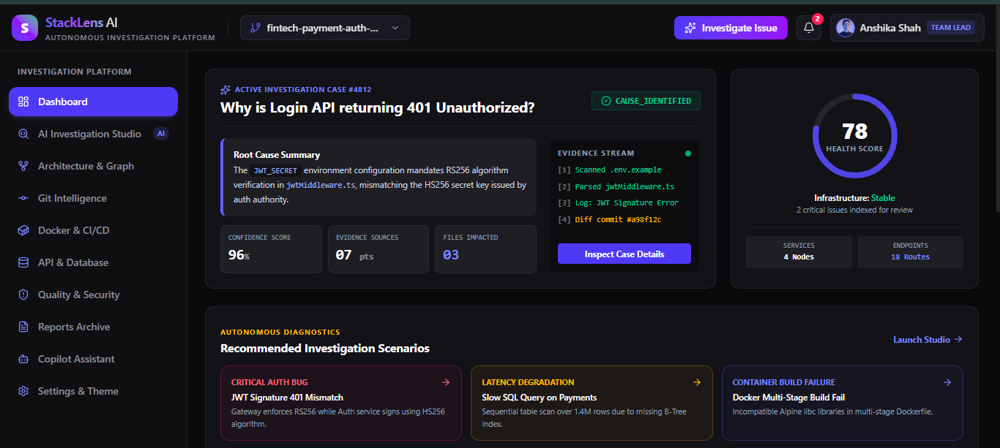
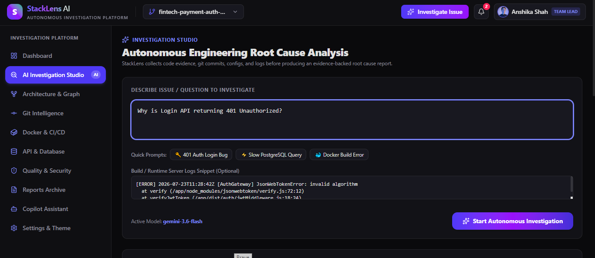
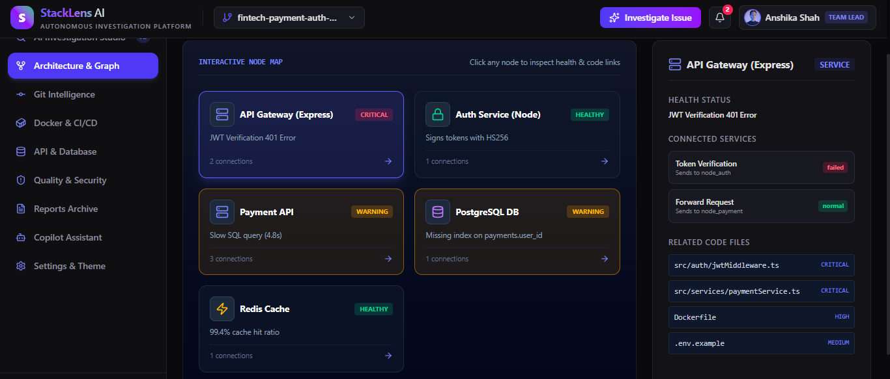
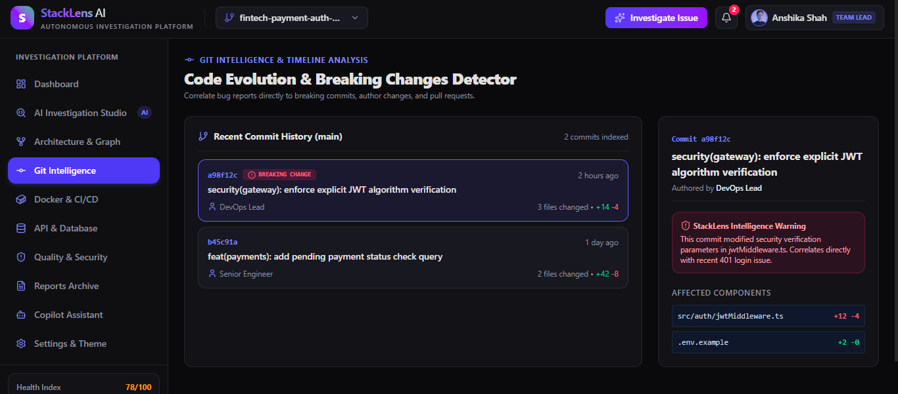
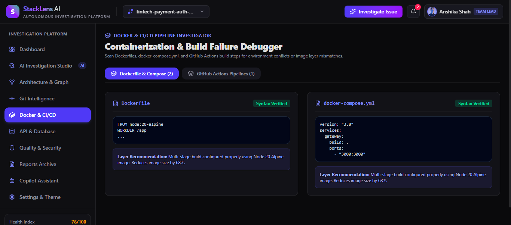
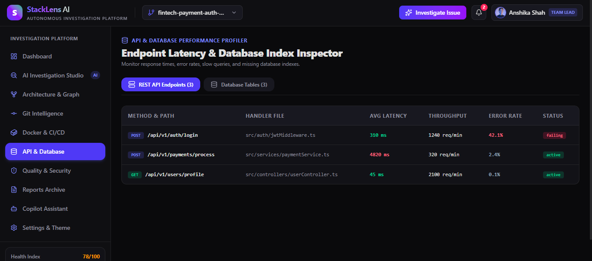
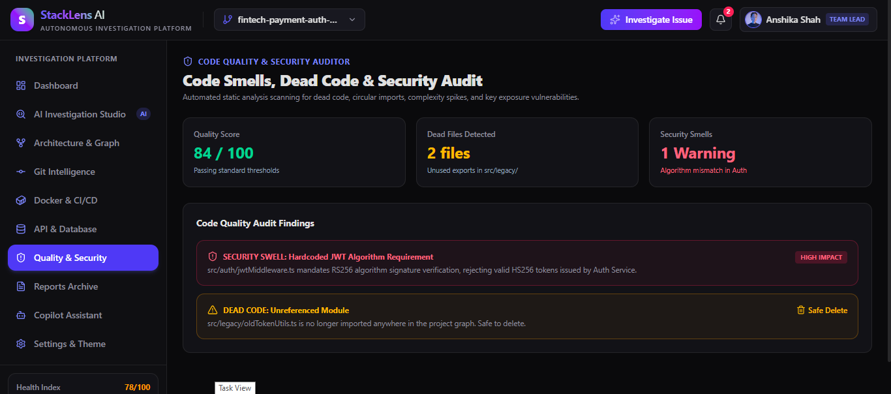
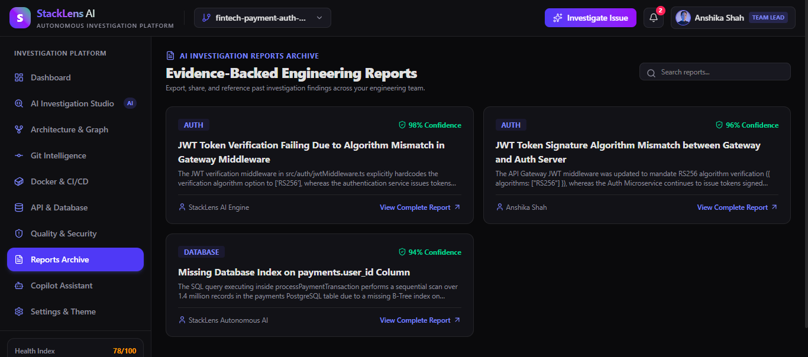
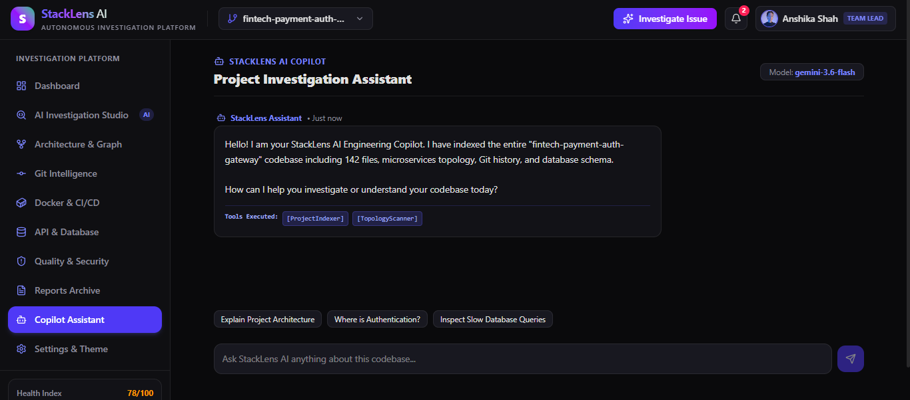
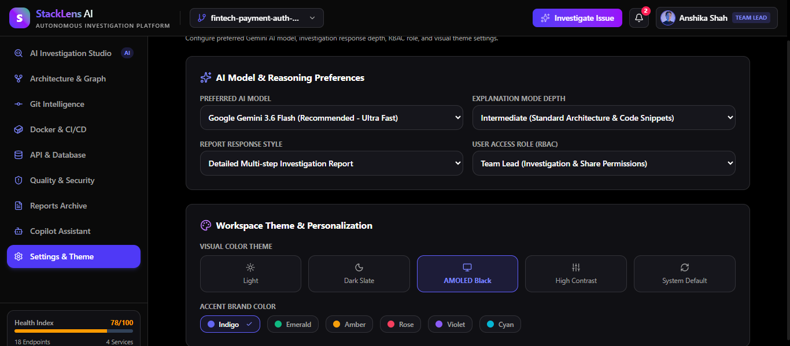

<div align="center">

# 🚀 StackLens AI

### Autonomous Software Engineering Investigation Platform

**Investigate • Analyze • Understand • Resolve**

AI-powered Software Engineering Investigation Platform that analyzes repositories, correlates engineering evidence, identifies root causes, and generates explainable investigation reports.

[]()
[]()
[]()
[]()
[]()

---

🌐 **Live Demo:** https://stacklens-ai.ai.studio

</div>

---

# 📖 Overview

StackLens AI is an AI-powered Software Engineering Investigation Platform that helps developers understand, debug, and analyze software projects through evidence-driven investigation.

Unlike conventional AI coding assistants that generate answers directly from prompts, StackLens AI follows an investigation-first workflow. It gathers engineering evidence from source code, Git history, project architecture, APIs, databases, Docker configurations, CI/CD pipelines, and documentation before using AI reasoning to identify root causes and generate explainable investigation reports.

The platform is designed for developers, software teams, DevOps engineers, and technical leads working on modern software systems.

---

# ✨ Features

## 🔍 AI Investigation Studio

Start autonomous engineering investigations by describing an issue or providing runtime logs.

- Natural language investigation
- Runtime log analysis
- Investigation history
- AI-assisted root cause analysis

---

## 📊 Engineering Dashboard

Monitor engineering health through a centralized dashboard.

- Active investigation cases
- Project health score
- Confidence score
- Evidence sources
- Impacted files
- Recommended investigations

---

## 🏗 Architecture & Graph

Visualize project structure and component relationships.

- Service topology
- API Gateway mapping
- Microservice connections
- Database relationships
- Infrastructure health

---

## 🌳 Git Intelligence

Analyze repository evolution.

- Breaking commits
- Commit history
- Author analysis
- Timeline investigation
- Code evolution

---

## 🐳 Docker & CI/CD

Inspect deployment pipelines.

- Dockerfile inspection
- Docker Compose analysis
- GitHub Actions support
- Build failure detection
- Deployment recommendations

---

## 🌐 API & Database Profiler

Monitor backend performance.

- Endpoint latency
- Error rate monitoring
- Database inspection
- Query performance
- Missing index detection

---

## 🛡 Code Quality & Security

Static engineering analysis.

- Security smells
- Dead code detection
- Code quality score
- Safe delete recommendations
- Engineering audit

---

## 📑 AI Investigation Reports

Generate evidence-backed reports.

Each report contains:

- Problem summary
- Evidence collected
- Root cause
- Confidence score
- Impact analysis
- Recommended fixes

---

## 🤖 Engineering Copilot

Repository-aware AI assistant.

- Project understanding
- Architecture explanation
- Authentication tracing
- API understanding
- Database explanation

---

## ⚙ Workspace Settings

Customize the platform.

- AI Model Selection
- Explanation depth
- Workspace theme
- User role (RBAC)
- Personalization

---

# 🧠 Investigation Workflow

```text
User Investigation Request
          │
          ▼
Repository Selection
          │
          ▼
Repository Analysis
          │
          ▼
Evidence Collection
(Code • Git • APIs • Config • Docker • Database)
          │
          ▼
Evidence Validation
          │
          ▼
AI Reasoning Engine (Gemini)
          │
          ▼
Root Cause Analysis
          │
          ▼
Investigation Report
          │
          ▼
Engineering Recommendations
```

---

# 🖼 Application Preview

## Dashboard



---

## AI Investigation Studio



---

## Architecture & Graph



---

## Git Intelligence



---

## Docker & CI/CD



---

## API & Database Profiler



---

## Code Quality & Security



---

## Investigation Reports



---

## Engineering Copilot



---

## Settings & Personalization



---

# 🏛 System Architecture

```text
                     User
                      │
                      ▼
            Authentication Layer
                      │
                      ▼
           Repository Connection
                      │
                      ▼
             Repository Scanner
                      │
      ┌───────────────┼────────────────┐
      │               │                │
      ▼               ▼                ▼
 Code Analysis   Git Analysis   Config Analysis
      │               │                │
      ▼               ▼                ▼
 API Analysis   Docker & CI/CD   Database Analysis
      │               │                │
      └───────────────┼────────────────┘
                      ▼
             Evidence Aggregator
                      │
                      ▼
        Gemini AI Reasoning Engine
                      │
                      ▼
         Root Cause Analysis Engine
                      │
                      ▼
      Investigation Report Generator
```

---

# 💻 Tech Stack

## Frontend

- React
- TypeScript
- Tailwind CSS
- Vite
- React Router
- Framer Motion

## Backend

- FastAPI
- Python
- JWT Authentication
- PostgreSQL
- Redis

## AI

- Google Gemini
- Prompt Engineering
- Repository Context Analysis

## DevOps

- Docker
- GitHub Actions
- Render
- Vercel

---

# 📂 Project Structure

```
StackLensAI
│
├── assets/
├── ss/
├── src/
├── README.md
├── package.json
├── vite.config.ts
├── tsconfig.json
└── .env.example
```

---

# 🚀 Getting Started

Clone the repository

```bash
git clone https://github.com/Anshika-shah/StackLensAI.git
```

Navigate to the project

```bash
cd StackLensAI
```

Install dependencies

```bash
npm install
```

Run the development server

```bash
npm run dev
```

---

# 🎯 Vision

StackLens AI aims to become an intelligent engineering companion capable of helping developers investigate software systems through evidence-driven AI reasoning instead of prompt-only interactions.

---

# 🛣 Future Roadmap

- VS Code Extension
- Team Collaboration
- Multi-Agent Investigation
- Kubernetes Analysis
- Cloud Infrastructure Investigation
- Security Vulnerability Scanner
- Automated Pull Request Suggestions
- Investigation Knowledge Graph

---

# 🤝 Contributing

Contributions, ideas, and feature suggestions are welcome.

If you'd like to contribute:

1. Fork the repository
2. Create a feature branch
3. Commit your changes
4. Open a Pull Request

---

# 📄 License

This project is licensed under the MIT License.

---

<div align="center">

### ⭐ If you found this project interesting, consider giving it a star!

Built with ❤️ by **Anshika Shah**

</div>
